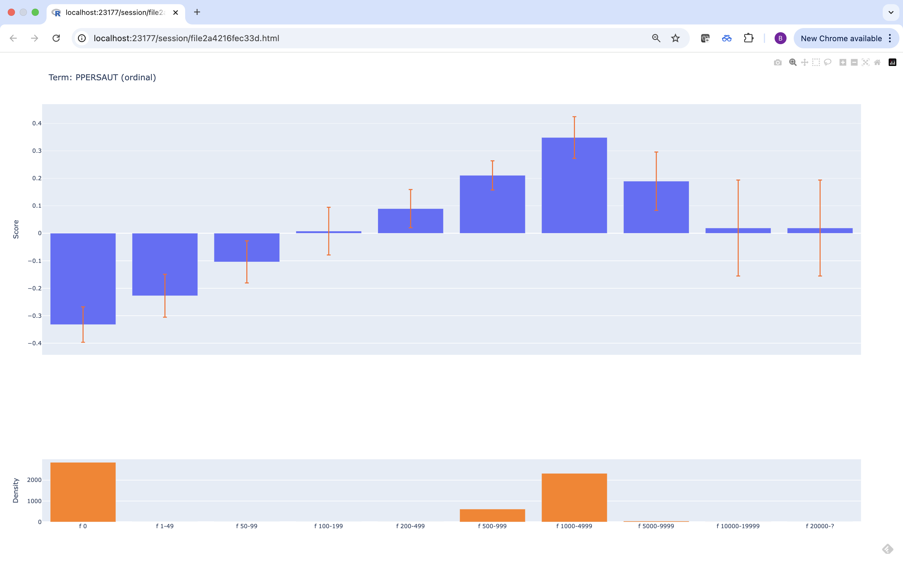

```{r setup, include=FALSE}
# Set global knitr chunk options
knitr::opts_chunk$set(
  cache = TRUE,
  fig.width = 6,
  fig.asp = 0.618,
  out.width = "100%",
  fig.align = "center",
  fig.pos = "!htb",
  message = FALSE,
  warning = FALSE
)
```

## Introduction

Generalized linear models (GLMs) [@nelder-1972-glm] have been a bedrock of statistical modeling for over fifty years. GLMs extend the classic linear model to accommodate non-Gaussian response distributions, as well as some degree of non-linearity in the model structure. In particular, GLMs have three components:

1. A random component, which specifies a distribution for the response $Y$ conditional on a set of predictors $\boldsymbol{x}$. In a traditional linear model, for instance, $Y|\boldsymbol{x}$ is often assumed to have a Gaussian (or normal) distribution with constant variance $\sigma^2$.

2. A systematic component, which specifies a linear combination of the regression coefficients and the predictors and is often called the *linear predictor*: $\eta = \beta_0 + \beta_1x_1 + \cdots + \beta_px_p = \boldsymbol{x}^\top\boldsymbol{\beta}$. (Note that linear here refers to the fact that $\eta$ is linear in the regression coefficients $\boldsymbol{\beta}$.)

3. A link function, which specifies how the linear predictor (systematic component) is linked to the conditional mean response $\mathrm{E}\left(Y|\boldsymbol{x}\right)$ (random component). In logistic regression, for instance, this is the logit function.

In essence, GLMs have the following basic form:
\begin{equation*}
  g\left(E\left[Y|\boldsymbol{x}\right]\right) = \beta_0 + \sum_{j=1}^p \beta_jx_j,
\end{equation*}
where $Y \sim$ some exponential family distribution, $g$ is the link function (e.g., typically the identity function for linear models, the logit for logistic regression, or the log link for Poisson regression), and $\boldsymbol{\beta} = \left(\beta_0, \beta_1, \dots, \beta_p\right)^\top$ are fixed but unknown regression coefficients to be estimated from the data (typically, via some form of maximum likelihood estimation). The definitive reference for GLMs has always been the monograph by @mccullagh-1989-glm.

Generalized additive models (GAMs) [@hastie-1990-gam] extend GLMs by replacing the systematic component of \@ref(eq:glm) with a sum of nonlinear smooth functions to get
\begin{equation}
  g\left(E\left[Y|\boldsymbol{x}\right]\right) = \beta_0 + \sum_{j=1}^p f_j\left(x_j\right),
  \label{eqn:gam}
\end{equation}
The functions $f_j$ are general enough that they can absorb the intercept (hence, sometimes we may omit the bias term $\beta_0$ in \eqref{eqn:gam}). Model \eqref{eqn:gam} is quite flexible in how the response depends on the predictors. Further, GAMs maintain explainability since the model's output can be understood by simply plotting the individual term contributions (sometimes called shape functions) $f_j\left(x_j\right)$. GAMs can also include interactions effects. For example, a pairwise interaction effect between $x_i$ and $x_j$ can be accommodated by including a bivariate term of the form $f\left(x_i, x_j\right)$. The terms in a GAM can be represented by a variety of functions. Traditionally, the terms in a GAM are represented using some form of smoothing splines. For a thorough overview of GAMs, see @wood-2017-gam.

@lou-2013-ga2m introduced generalized additive models plus interactions (GA^2^Ms) which automatically search for and include important pairwise interaction terms using an algorith called FAST^[As far as I can tell, FAST is not an acronym for anything in particular.]. The resulting model consists of univariate terms and a small number of pairwise interaction terms. Since GA^2^Ms are low-dimensional, they can still be visualized and interpreted by users while potentially being more accurate. A GA^2^M has the general form
\begin{equation}
  g\left(E\left[Y|\boldsymbol{x}\right]\right) = \sum f_i\left(x_i\right) + \sum f_{ij}\left(x_i, x_j\right).
  \label{eqn:ga2m}
\end{equation}
Here we've simply abosrbed the bias term (or intercept) into the shape functions $f_i$. In contrast to tradition GAMs \eqref{eqn:gam}, the shape functions in \eqref{eqn:ga2m} are not necessarily smooth. In particular, modern GA^2^Ms often rely on tree-based methods and gradient boosting [@greenwell-2022-tree], which tend to produce more rigid step functions.


# Explainable boosting machines

Explainable boosting machines [@nori-2019-interpret], or EBMs for short, are a modern class of GA^2^Ms, that can offer both competitive accuracy and explicit transparency and explainability, which are often considered to be two opposing goals of a machine learning (ML) model. For example, full-complexity models, like random forests [@breiman-2001-rf], tend to be highly competitive in terms of accuracy, but are readily less transparent and explainable (due in part to the high-order interaction effects often captured by such black-box models). Essentially, with EBMs, it's possible to ``have your cake and eat it too.''

In short, EBM models have the general form

\begin{equation}
g\left(E\left[y\right]\right) = \theta_0 + \sum f_i\left(x_i\right) + \sum f_{ij}\left(x_i, x_j\right),
  \label{eqn:ebm}
\end{equation}

Where blah, blah, blah \@ref(eq:ga2m)

where

* $g$ is a \emph{link function} that allows the model to handle various response types (e.g., the *logit* link for logistic regression or the identify function for ordinary regression with continuous outcomes);

* $\theta_0$ is a constant intercept (or bias term);

* $f_i$ is the \emph{term contribution} (or \emph{shape function}) for predictor $x_i$ (i.e., it captures the main effect of $x_i$);

* $f_{ij}$ is the term contribution for the pair of predictors $x_i$ and $x_j$ (i.e., it captures the joint effect, or pairwise interaction effect of $x_i$ and $x_j$).

Similar to *generalized additive models plus interactions* (Lou et al. 2013), or GA^2^Ms for short, the pairwise interaction terms are determined automatically using the FAST algorithm described in Lou et al. (2013). In short, FAST is a novel, computationally efficient method for ranking all possible pairs of feature candidates for inclusion into the model (by default, the top 10 pairwise interactions are used). The primary difference between EBMs and GA^2^Ms is in how the shape functions are estimated. In particular, EBMs use *cyclic gradient boosting* (Nori et al. 2019; Wick, Kerzel, and Feindt 2020) to estimate the shape functions for each feature (and selected pairs of interactions) in a round-robin fashion using a low learning rate to help ensure that the order in which the feature effects are estimated does not matter. Estimating each feature one-at-a-time in a round-robin fashion also helps mitigate potential issues with *collinearity* between predictors (Nori et al. 2019; Wick, Kerzel, and Feindt 2020).

TODO: Move the following sections to later and modify. Also, talk about model editing and how EBMs are editable. Maybe a GAM-CHANGER example if there's room?!

However, in contrast to the more common gradient boosting machine (J. H. Friedman 2001, 2002), or GBM for short, which can ignore irrelevant inputs, EBMs include at least one term in the model for each feature: one main effect ($f_i$) for each predictor, and a term for each selected pairwise interaction effect. This is due to the cyclic nature of the underlying boosting framework. For example, an EBM applied to a training set with $p = 300$ features will result in a model with at least 300 terms.

While EBMs are considered *glass-box* models, an EBM with, say, hundreds or thousands of terms, starts to become much less transparent and explainable. Moreover, the larger the fitted model (i.e., the more terms there are), then the more time it will take the EBM to make predictions, making larger models less fit for deployment and production.

To this end, we also propose in Section XYZ a way to introduce sparsity into a fitted EBM by rescaling the individual terms (i.e., the $f_i$ and $f_{ij}$) via regression coefficients estimated from a method called the LASSO (Tibshirani 1996). Consequently, by nature of the $L_1$ regularization enforced by the LASSO, many of these coefficients can be estimated to be zero, resulting in a reduced EBM with far fewer terms (and hopefully, comparable accuracy)!


## Software

EBMs are implemented as part of the **InterpretML** framework [@nori-2019-interpret], which includes both a Python and R interface called **interpret**. While the Python implementation is fully functional and rich with features (e.g., interactive graphics), the R version [@R-interpret] currently lags behind. For instance, the R interface only supports classification settings and limited options (e.g., monotonic constraints are not currently supported). 

Further, the plotting functionality of the R \pkg{interpret} package only supports visualizing a single feature using static plots (i.e., no interactive visualizations, no visualizations for pairwise interactions, feature importance plots, or support for visualizing local explanations). Because of these serious drawbacks, we've developed the \CRANpkg{ebm} package, which is a full-featured R interface to the Python \pkg{interpret} library powered by \CRANpkg{reticulate} [@R-reticulate].

In the next section, we'll discuss the \pkg{ebm} package in detail and provide several examples that cannot be replicated through use of the official \pkg{interpret} package in R.


# The \pkg{ebm} package

The \pkg{ebm} package is an R wrapper around the explainable boosting functionality of the \pkg{interpret} module in Python, powered by \CRANpkg{reticulate}. The main features of this package, especially when compared to the R package \pkg{interpret}, include:

* Support for all the objective (i.e., loss) function provided by the Python modeule (e.g., Poisson devaince for modeling counts).
* Static and interactive graphics for explaining the model.
* Global and local explanations for a fitted model.
* Convenient generic function like `print()`, `plot()`, and `predict()`.
* Support for loading in EBM models fit via the corresponding Python module.


## Predicting and explaining policy ownership (the CoIL 2000 challenge)

In this section, we briefly describe a binary classification example using data from the CoIL 2000 Challenge [@putten-2004-coil]. The data set, which we'll obtain from the R package \CRANpkg{kernlab} [@R-kernlab], consists of 9822 customer records containing 86 variables, including product usage data and socio-demographic data derived from zip area codes. The goal of the challenge was to be able to answer the following question: ``Can you predict who would be interested in buying a caravan insurance policy and give an explanation of why?'' Hence, being able to explain your model's predictions was key to being successful in this challenge.

<!-- The winning entry, by Charles Elkan [@elkan-2001-coil], correctly identified 121 caravan policy holders among its 800 top predictions. Our initial EBM (see the R code in the appendix) correctly identified 131. After applying the LASSO, we ended up with a simplified EBM with only 13 terms (quite a reduction from the original 96, counting the intercept)! Moreover, the simplified EBM actually did slightly better and successfully identified 134 policy holders using the top 800 predictions. Woot! Well, technically, the reduced model doesn't provide a fair comparison here since we already used the test data to estimate the LASSO coefficients, which is technically leakage\footnote{In an ideal setting, we'd hopefully have access to a separate and independent sample to use for estimating the LASSO coefficients, and which would not be used in any of the validation or final model comparisons.}. -->

To start, we'll load in the data and split into train/test sets using the same partitioning as the original competition (see `?kernlab::ticdata` for variable descriptions and further details):

```{r tic}
data("ticdata", package = "kernlab")
ticdata$CARAVAN <- ifelse(ticdata$CARAVAN == "insurance", 1L, 0L)
tictrn <- ticdata[1:5822, ]     # training data (N = 5822)
tictst <- ticdata[-(1:5822), ]  # test data (N = 4000)
```

Since there's currently no easy way to set the positive class in `ebm()`, we manually encoded the response factor as a 0/1 outcome, where $Y = 1$ corresponds to the `"insurance"` category. This important since it determines how we interpret the model later. In the future, we'll add a convenience argument to make this simpler (e.g., `pos_class = "insurance"`). (Note that R's internal function `relevel()` from package \pkg{stats} won't work here since the conversion happens under the hood on the Python side.)

```{r tic-ebm}
library(ebm)

# Fit a default EBM classifier
(tic_ebm <- ebm(CARAVAN ~ ., data = tictrn, objective = "log_loss"))
```

In this example, a default call to `ebm()` produced a GA^2^M with 162 total terms: 85 main effects (one for each feature), 77 pairwise interactions, plus an intercept. Further, notice that EBMs use the logit link function for binary outcomes, similar to logistic regression. This is important to call out since the link function determines the scale for interpreting the main effects and pairwise interactions in the model, which we'll discuss shortly.

EBMs are random in nature due to random subsampling (used for early stopping during boosting) and bagging. For reproducibility you might be tempted to call `set.seed()` prior to analysis, but this will have no effects! Since the randomness occurs on the Python side, we have to use the provided `random_state` argument in the call to `ebm()`. The default is `random_state = 42L` which makes the output reproducible from run to run. Setting `random_state = NULL` generates non-repeatable sequences and therefore the results will not be reproducible.

Predictions can be obtained using the generic `predict()` method. The type of prediction is controlled via the `type` argument, which defaults to `type = "response"`. For classification, this results in a matrix of predicted probabilities. Other options useful options here are `type = "link"` (i.e., predictions on the logit scale) and `type = "class` for predicting class labels. Each of these are shown below for the test set:

```{r tic-ebm-predict}
# Compute predictions on the probabilitt scale
head(probs <- predict(tic_ebm, newdata = tictst))

# Compute predictions on the link (i.e., logit) scale
head(predict(tic_ebm, newdata = tictst, type = "link"))

# Look at confusion matrix from default predicted class labels
labels <- predict(tic_ebm, newdata = tictst, type = "class")
table("Observed" = tictst$CARAVAN, "Predicted" = labels)
```

The winning entry, by Charles Elkan [@elkan-2001-coil], correctly identified 121 caravan policy holders among its 800 top predictions for the test set. The EBM fitted above does exactly the same according to the cumulatice gains computed below:

```{r tic-ebm-cumulative-gains}
ord <- order(probs[, 2L], decreasing = TRUE)
sum(tictst$CARAVAN[ord[1:800]])  # number of 1s if we sort by highest prob
```

The code chunk below uses the well-known \CRANpkg{rmse} package [@R-rms] to construct a flexible smooth calibration curve based on the test set predicted probabilities, along with some relevant performance statistics. For instance, the area under the receiver operating characteristic curve based on the test data for this model is 0.734.

```{r tic-ebm-calibration, fig.cap="Calibration curve and validation statistics based on the the test set."}
par(las = 1)
rms::val.prob(probs[, 2L], y = tictst$CARAVAN, cex = 0.5)
```

After training a model, it's often desirable to have a way to persist the model for future use without having to retrain it. In R, we can typically save the result of a model using `saveRDS()`. Alternatively, some packages provide a more native solution, like CRANpkg{xgboost}'s `xgb.save()` function. These solutions will not work here since the connection to the underlying Python object is lost once the session is finished. The proper way to handle this is to use \pkg{reticulate}'s `py_save_object()` and `py_load_object()` functions to save and load the underlying Python object. This works by serializing the fitted EBM object using Python's \pkg{pickle} module. Advanced \pkg{reticulate} users could also rely on rely on the \pkg{joblib} module or even exporting the fitted model to ONNX (Open Neural Network Exchange) via the \pkg{ebm2onnx} module, depending on the need. For more details on persisiting a fitted model in Python visit https://scikit-learn.org/stable/model_persistence.html. Here we'll show how to persist a fitted EBM model using both \pkg{pickle} (through \pkg{reticulate}'s built-in functions mentioned above), as well as \pkg{joblib}.

Note that a serialized `"EBM"` object get stripped of the `"EBM"` class which is used for calling various methods, like `plot()`, which we'll discuss later. To overcome that issues, we provide an `as.ebm()` function for adding on the appropriate class. This of course also means that you can import EBM models fitted with the Python \pkg{interpret} module into R for use with `print()`, `plot()`, etc.

```{r tic-ebm-pickle}
# Save a fitted EBM model
reticulate::py_save_object(tic_ebm, filename = "tic_ebm.pkl")

# Load a pickled EBM model
(ebm_obj <- reticulate::py_load_object("tic_ebm.pkl"))
(tic_ebm <- as.ebm(ebm_obj))  # adds "EBM" class for using print(), plot(), etc.
```

Note that the original function call prints as `NULL` since it's impossible to determine from the specific object we called `as.ebm()` on.

In the specific case of an EBM, it may be more useful to use Python's \pkg{joblib} module, which provides the `joblib.dump()` and `joblib.load()` function for serializing and deserializing a Python object, respectively; this approach is more efficient on objects that carry large \pkg{numpy} arrays internally as is usually the case for a fitted EBM model (all the term contributions, etc. are stored as \pkg{numpy} arrays). As of this writing, \pkg{reticulate} does not support \pkg{joblib} through any convenience function (e.g., like `py_save_object()`), so we'll need to interface with the module directly, as shown below:

```{r tic-ebm-joblib}
joblib <- reticulate::import("joblib")  # assumes joblib module is available

# "Dump" the fitted EBM model into a pickle file
joblib$dump(tic_ebm, filename = "tic_ebm_joblib.pkl")

# Load a pickled EBM model
(tic_ebm <- as.ebm(joblib$load("tic_ebm_joblib.pkl")))
```

Fitted `"EBM"` objects can be understood and visualized using the generic `plot()` method. By default, `plot()` relies on \CRANpkg{ggplot2} [@R-ggplot2] for variable importance and main effect plots; for visualizing pairwise interactions, it relies on \CRANpkg{lattice}'s `levelplot()` function. For convenience, we'll also use \CRANpkg{patchwork} [@R-patchwork] for configuring the layout for displays with multiple plots.

Below, we use the `plot()` method to display a few global summaries of the fitted model. First, we display the overall term importance scores. By default, all terms are plotted so it's a good idea to set the `n_features` argument to something reasonable if the model contains lots of terms. Here we tell it to display the top 15 terms in the model. The importance scores are computed as the mean absolute score from each term in the model.

```{r tic-ebm-importance, fig.cap="Term importance scores computed as the mean absolute score for each term in the fitted model."}
library(ggplot2)
library(patchwork)

theme_set(theme_bw())  # my preferred theme for ggplot2

# Plot feature importance
plot(tic_ebm, n_terms = 15)  
```

The default behavior is to produce a dotchart, but you can switch to a bar plot by setting `geom = "col"` in the call to `plot()`. Setting `horizontal = TRUE` will also produce a plot that's been flipped on its axes. See `?ebm::plot.EBM` for details.

Next, we'll plot the main effect for `PPERSAUT`, the highest rated term in the model, by setting `term = "PPERSAUT"` in the call to `plot()`; note that this is just a plot of shape function $f\left(\mathtt{PPERSAUT}\right)$ from \eqref{eqn:ebm}. It's good practice to include some information regarding the distribution of ther variable of interest to help avoid extrapolation and over interpreting such plots.

```{r tic-ebm-term-PPERSAUT, fig.cap="Main effect of $\\mathtt{PPERSAUT}$."}
plot(tic_ebm, "PPERSAUT", horizontal = TRUE) +  # main effect plot
  ggplot(tictrn, aes(PPERSAUT)) +  # add distribution plot
  geom_bar() + 
  scale_x_discrete(drop = FALSE) +  # don't drop zero counts 
  xlab("") +
  coord_flip()
```

`PPERSAUT` is an ordered factor representing the contribution level for car policies. The left side of Figure \ref{fig:tic-ebm-term-PPERSAUT} shows a generally increasing relationship between contribution to car policies and the log odds of buying a mobile home policy. The distribution of `PPERSAUT` in the training data is also shown on the right side of Figure \ref{fig:tic-ebm-term-PPERSAUT}. You can similarly display heatmaps for pairwise interactions, but we'll reserve this for an example in a later section of this paper.

One attractive feature of the \pkg{interpret} Python module is the use of interactive graphics and dashboards (e.g., via Plotly [@plotly]). This feature is not available in the corresponding R package. Since we can expose the full functionality of the Python version through \pkg{reticulate}, the `plot()` function can be used to also produce the same interactive graphics. These can be viewed either in the browser (the default) or in an interactive viewer like the ones built into RStudio or VS Code. Below we reproduce the main effect term for `PPERSAUT` using an interactive Plotly/HTML-based graphic that will open by default in a browser. This will work for any of the visualizations discussed in this paper. Note, however, that while \pkg{ebm} supports multiclass outcomes, only interactive visualizations are available (i.e., no static \pkg{ggplot2}-based plots). Of course, these plots can always be constructed quite easily following the approach discussed at the end of this section.

```{r tic-ebm-term-PPERSAUT-html, eval=FALSE}
plot(tic_ebm, term = "PPERSAUT", interactive = TRUE)
```
```{r tic-ebm-term-PPERSAUT-html-hide, echo=FALSE, fig.cap="Screenshot of an interactive visualization for the main effect of $\\mathtt{PPERSAUT}$ displayed in a Google Chrome browser."}

```

Let's look at the second most important term, `APERSAUT`, which corresponds to a continuous feature representing the number of car policies owned. The main effect for `APERSAUT` is displayed in the left side of Figure \ref{fig:tic-ebm-term-APERSAUT}. We might expect there to be an increasing monotonic relationship between `APERSAUT` and the log odds of buying a mobile home policy. In fact, it's often desirable that the shape functions $f_j\left(x_j\right)$ in \eqref{eqn:ebm} be constrained in some way. This may be due to business considerations, or because of some a priori belief about the underlying relationships between the predictors and the response. In such cases, we may wish to enforce a type of constraint called monotonicity on some of the terms in the model. This means, for example, that the relationship between $x_j$ and $y$, as modeled through $f_j\left(x_j\right)$ should always be increasing or decreasing. For instance, a monotonic increasing relatiobnship would ensure that $f_j\left(x_j\right) \ge f_j\left(x_j'\right)$ whenever $x_j \ge x_j'$ (and vice versa for a decreasing monotonic relationship).

To illustrate the idea, we'll enforce a decreasing monotonic relationship between `APERSAUT` and the log odds of purchasing a mobile policy (`CARAVAN`). While we can enforce monotonic constraints via the `monotone_constraints` argument in the call to `ebm()`, the \pkg{interpret} authors generally recommend forcing monotonicity by post-processing the graphs of the fitted model instead using isotonic regression. This is the recommended approach as it prevents the model from compensating for the monotonicity constraints by learning non-monotonic effects in other highly-correlated features. We can follow this route by calling the `$monotonize()` method that's bound to the fitted `"EBM"` object. Note that calling this method will modify the original object in place, so to preserve the original object, we'll also call the `$copy()` bound method to make a deep copy. Additionally, we lose any uncertainty associated with the term from the outer bagging in the original model.

```{r tic-ebm-term-APERSAUT, fig.cap="Main effect for $\\mathtt{APERSAUT}$ Left: Original (i.e., unconstrained) effect. Right: Decreasing monotonic effect through post-pocessing the left figure using isotonic regression."}
tic_ebm_mono <- as.ebm(tic_ebm$copy())  # make a deep copy to leave original intact
tic_ebm_mono$monotonize("APERSAUT", increasing = FALSE)

# Display results side by side
plot(tic_ebm, term = "APERSAUT") + ggtitle("Original") +
  plot(tic_ebm_mono, term = "APERSAUT") + ggtitle("Monotonized")
```

While the \pkg{ebm} package functions do not expose 100% of the functionality available in the corresponding Python module, this example shows that you can pretty much do anything you need by interacting directly with the underlying Python objects (the magic happens through \pkg{reticulate}). For example, to reproduce the original HTML-based visualization, which will be displayed in a browser, you can do the following:

```{r tic-ebm-term-APERSAUT-monotonize-html-noeval, eval=FALSE}
idx <- as.integer(which(tic_ebm$term_names_ == "APERSAUT") - 1L) 
plt <- tic_ebm$explain_global()$visualize(idx)
plt$show()  # should open in a browser; can also call `plt$write_html("<path/to/file.html>")`
```

Details aside, you can access the data to recreate the plot (like the `plot()` method does), by coercing the internal Python plotly object to an ordered dictionary which \pkg{reticulate} will automatically convert to a list. For instance, the following snippet of code extracts the main data used in generating the previous plot.

```{r tic-ebm-term-APERSAUT-monotonize-html, echo=FALSE}
idx <- as.integer(which(tic_ebm$term_names_ == "APERSAUT") - 1L) 
plt <- tic_ebm$explain_global()$visualize(idx)
```
```{r ebm-term-APERSAUT-monotonize-list}
plt$to_ordered_dict()$data[[1L]]
```

The visualizations discussed so far are examples of *global explanations*. We can also explain the model's output at the local (i.e., prediction) level. This is more commonly done for general machine learning models using techniques like SHAP (SHapley Additive exPlanations) [@lundberg-2017-shap] and LIME (Local Interpretable Model-agnostic Explanations) [@ribeiro-2016-lime]. Techniques like these typically make assumptions about independence and so forth and only provide an approximation to how features contribute to a model's output. With EBMs, we can visualize exactly how each term in the model contributes to a specific prediction (this is true for GAMs in general).

Below, we call the `plot()` method to explain the prediction associated with the first instance of the test sample. The EBM model predicts a very low probability of purchasing a mobile home policy ($\hat{p}\left(\boldsymbol{x}\right) = 0.0316$), and we'd like to know how each term in the model contributed to that prediction. Note that we need to specify a couple of additional arguments here. In particular, we need to set `local = TRUE` and provide the input features as a data frame via the `X` argument. You can optionally provide the response values, but this only affects the interactive version (i.e., when setting `interactive = TRUE`) by displaying the associated predicted and observed response value at the top. The results are displayed in Figure \ref{fig:tic-ebm-local}.

```{r tic-ebm-local, fig.cap="ABC..."}
newx <- subset(tictst[1L, ], select = -CARAVAN)
newy <- tictst$CARAVAN[1L]  # not useful unless `interactive = TRUE`
plot(tic_ebm, local = TRUE, X = newx, y = newy)
```

From Figure \ref{fig:tic-ebm-local} we can see that the biggest drivers for a low score were the fact that this customer did not appear to have or make any contribution toward existing car policies.


## Predicting ALS progression (the DREAM challenge prediction prize)

In this section, we'll look at a brief example using the ALS data from Efron and Hastie (2016, 349). A description of the data, along with the original source and download instructions, can be found at \url{https://hastie.su.domains/CASI/data.html}.

These data concern 1822 observations on *amyotrophic lateral sclerosis* (ALS or Lou Gehrig's disease) patients. The goal is to predict ALS progression over time, as measured by the slope (or derivative) of a functional rating score (i.e., column `dFRS`), using 369 available predictors obtained from patient visits. The data were originally part of the DREAM-Phil Bowen ALS Predictions Prize4Life challenge. The winning solution [@kuffner-2015-als] used a Bayesian tree ensemble quite similar to a random forest, while \cite[chap. 17]{efron-2016-casi} analyzed the data using gradient tree boosting via the R package \CRANpkg{gbm} [@R-gbm].

<!-- FIXME: Modify this and add it before the ISLE example with EBMs. -->
<!-- ; the latter also used the LASSO to post-process their fitted ensmeble to compress  to show how a GBM model can be simplified while maintaining accuracy close to the original fit. --> 

Below, we load in the ALS data from a URL and fit a default EBM. Note that the data already contain an indicator for the train/test splits, so we use that to split the data and discard the column after. We also compute the MSE on the test set.

```{r als}
# Laod data and split into train/test sets
url <- "https://hastie.su.domains/CASI_files/DATA/ALS.txt"
als <- read.table(url, header = TRUE)
alstrn <- subset(als, subset = !testset, select = -testset)  # training data
alstst <- subset(als, subset = testset, select = -testset)   # test data

# Fit a default EBM regressor
(als_ebm <- ebm(dFRS ~ ., data = alstrn, objective = "rmse"))

# Compute MSE on the test set
pred <- predict(als_ebm, newdata = alstst)
(mse_tst <- mean((alstst$dFRS - pred)^2))
```

The fitted EBM model contains 702 terms (369 main effect terms, one for each predictor, and 333 pairwise interaction terms) plus an intercept. The mean square error for this model on the test data was 0.267. The top 10 terms are displayed in Figure \ref{fig:als-ebm-importance} below. Here, we see that `Onset.Delta` is by far the most important predictive feature in the model.

```{r als-ebm-importance, fig.cap="ABC."}
plot(als_ebm, n_terms = 10)  # Figure XYZ
```

As briefly mentioned in the previous example, we can also plot pairwise interaction effects using a heatmap (or contour plot). Below we plot the term contribution for $f\left(\mathtt{Onset.Delta}, \mathtt{last.slope.weight}\right)$.

```{r als-ebm-pairwise-interaction, fig.cap="ABC."}
plot(als_ebm, term = c("Onset.Delta", "last.slope.weight"))
```

Compared to "black-box" models, like random forests and deep neural networks, EBMs are considered "glass-box" models that can be competitively accurate while also maintaining a higher degree of transparency and explainability. However, EBMs become readily less transparent and harder to interpret in high-dimensional settings with many predictor variables; they also become more difficult to use in production due to increases in scoring time. We propose a simple solution based on the least absolute shrinkage and selection operator (LASSO) that can help introduce sparsity by reweighting the individual model terms and removing the less relevant ones, thereby allowing these models to maintain their transparency and relatively fast scoring times in higher-dimensional settings. In short, post-processing a fitted EBM with many (i.e., possibly hundreds or thousands) of terms using the LASSO can help reduce the model's complexity and drastically improve scoring time. For methodological (and software) details, see @greenwell-2023-explainable.

We'll illustrate the basic idea using the previous model, which contains `r length(als_ebm$term_names_) + 1` total terms comprised of the main effects, pairwise interactions, and an intercept.

In the next chunk, we'll construct data matrices consisting of the individual term contributions for both the train and test sets. For example, the $j$-th column of `X_trn` is given by the contribution of the $j$-th term of the model $\left\{f_j\left(x_{ij}\right)\right\}_{i=1}^n$ over the training set. In particular, note that `rowSum(terms_trn) + fit$intercept_` is equivalent to calling `predict(fit, newdata = X_trn)`. These data matrices will be used as input to the LASSO shortly after.

```{r als-ebm-term-matrices}
X_trn <- predict(als_ebm, newdata = alstrn, type = "terms")
X_tst <- predict(als_ebm, newdata = alstst, type = "terms")
colnames(X_trn) <- colnames(X_tst) <- als_ebm$term_names_
print(dim(X_trn))  # same rows as alstrn, but one column for each term in model

# Sanity check (should be equivalent)
head(cbind(
  rowSums(X_trn) + c(als_ebm$intercept_),
  predict(als_ebm, newdata = alstrn)  # additive on link scale
))
```

Next, we use the [glmnet](https://cran.r-project.org/package=glmnet) package to fit the LASSO path to the new data set comprised of the individual term contributions. We then assess performance using the associated test set and collect the results.

```{r als-ebm-lasso}
library(glmnet)

# Fit the LASSO regularization path using the term contributions as inputs
lasso <- glmnet(X_trn, y = alstrn$dFRS, lower.limits = 0, standardize = FALSE)

# Assess performance of fit using an independent test set
perf <- assess.glmnet(lasso, newx = X_tst, newy = alstst$dFRS)
perf <- do.call(cbind, args = perf)  # bind results into matrix

# Collect results and sort by number of non-zero coefficients/terms
res <- as.data.frame(cbind("n_terms" = lasso$df, perf, "lambda" = lasso$lambda))
head(res <- res[order(res$n_terms), ])
```

Next, we'll compute the `lambda` value associated with the smallest deviance (or half the log-loss). Here are the results for the compressed EBM corresponding to this value of `lambda`:

```{r als-ebm-lasso-results}
lambda <- res[which.min(res$mse), "lambda"]
res[which.min(res$mse), ]
```

Finally, we can plot the results! On the left, we show the LASSO coefficient path and on the right we show the test deviance as a function of the number of terms in the compressed model.

```{r als-ebm-lassso-plot}
par(mfrow = c(1, 2), mar = c(4, 4, 0.1, 0.1), cex.lab = 0.95, 
    cex.axis = 0.8, mgp = c(2, 0.7, 0), tcl = -0.3, las = 1)
plot(lasso, xvar = "lambda", col = adjustcolor("darkred", alpha.f = 0.3),
     xlab = "Log lambda")
abline(v = log(lambda), lty = 2, col = 1)
plot(res[, c("n_terms", "mse")], type = "l", las = 1,
     xlab = "Number of terms", ylab = "Test MSE")
abline(h = mse_tst, lty = 2, col = "darkred")
```

The test MSE for the compressed model is `r res[which.min(res$mse), "mse"]`...

Lastly, we can call the `$scale()` and `$sweep()` methods to reweight and purge any unused terms from the model:

```{r als-ebm-lasso-scale}
als_ebm_lasso <- as.ebm(als_ebm$copy())
weights <- coef(lasso, s = lambda)  # LASSO coefficients (most are zero!)
weights <- setNames(as.numeric(weights), nm = rownames(weights))
for (i in seq_along(weights[-1L])) {
  idx <- as.integer(i - 1L)  # Sigh, Python indexing starts at 0
  als_ebm_lasso$scale(idx, factor = weights[i + 1])
}
als_ebm_lasso$intercept_ <- weights[1L]

# Remove unused terms!
als_ebm_lasso$sweep(terms = TRUE, bins = TRUE, features = FALSE)
length(als_ebm_lasso$term_names_)
plot(als_ebm_lasso)  # show new feature importance scores
```

And just as a sanity check, we can see that the compressed (i.e., reduced) model does produce the right predictions. An ROC curve via the [pROC](https://cran.r-project.org/package=pROC) is also constructed and shown below.

```{r als-ebm-lasso-sanity}
# Compare predictions between LASSO and compressed EBM (should be the same!)
head(cbind(
  "EBM (LASSO)" = predict(als_ebm_lasso, newdata = alstst),
  "LASSO" = predict(lasso, newx = X_tst, s = lambda, type = "response"))
)
```

@greenwell-2023-explainable provide a similar compression analysis applied to the CoIL 2000 example via interfacing directly with the Python \pkg{interpret} module through \pkg{reticulate}.


## Parallelization

TBD. Use bike share example here. Note that negative integers are interpreted using \pkg{joblib}'s formula: `n_cpus + 1 + n_jobs`. For example, setting `n_jobs = -2` will result in using all threads except for one. The default is `n_jobs = -1` which results in using all available CPUs.

TODO: Describe what's happening in the code. Also mention the defaults.
Below is a brief example using the `Bikeshare` data available in \CRANpkg{ISLR2} [@R-ISLR2]. Outer bags are used to generate error bounds and help with smoothing the graphs.

```{r bikeshare-parallel, fig.cap="ABC. Left: ABC. Right: ABC."}
keep <- c("workingday", "temp", "weathersit", "mnth", "hr", "bikers") 
bikeshare <- ISLR2::Bikeshare[, keep]

# Use all CPUs (this is the default, which sets n_jobs = -1)
system.time({
  ebm1 <- ebm(bikers ~ ., data = bikeshare, objective = "poisson_deviance",
              inner_bags = 20, outer_bags = 16, n_jobs = -1)
})

# Use one CPU
system.time({
  ebm2 <- ebm(bikers ~ ., data = bikeshare, objective = "poisson_deviance",
              inner_bags = 20, outer_bags = 16, n_jobs = 1)
})

# Use all CPUs, but no bagging
system.time({
  ebm3 <- ebm(bikers ~ ., data = bikeshare, objective = "poisson_deviance",
              inner_bags = 0, outer_bags = 1, n_jobs = -1)
})

# Plot results (Figure XYZ)
plot(ebm2, term = "temp") + plot(ebm3, term = "temp") 
```


## Tuning strategies

Recommended tuning strategies for EBMs are discussed in the \pkg{interpret} module's FAQ: https://interpret.ml/docs/faq.html. We outline the essential points here. Similar to random forests, the default hyperparameters for EBMs tend to perform reasonably well on most problems; hence, we stuck with the default for the examples in this paper. A reasonable strategy is to train an initial model using the defaults and looking through the learned functions to catch unexpected or abnormal behavior---oftentimes, these graphs can help indicate which parameters should be tuned. Here are some general recommendations from the \pkg{interpret} module developers:

* For accuracy, it's generally recommend to set `outer_bags` and `inner_bags` to 25 or more each. This will significantly slow down the training time of the algorithm, and may be infeasible on larger data sets, but tends to produce smoother graphs with marginally higher accuracy. Note that the algorithm is parallelized at the outer bags level, so typically you'll pay a steeper price in terms of computing time for larger values of the inner bags parameter.

* If you believe your model might be overfitting (e.g., large difference between train and test error, or high degrees of instability in the graphs), consider reducing `max_bins` for smaller data sets (to clump more data together) and take a more aggressive approach to early stopping by decreasing `early_stopping_rounds` and increasing `early_stopping_tolerance`. Conversely, if you believe your model is underfitting, you can do the opposite of the previous suggestions (it might also be helpful to increase `max_rounds`).

* If several pairwise interaction effects seem realtively important (i.e., are appearing higher up on the term importance list/plot), then try increasing the maximum number of allowed interactions via the `interaction` argument.

* For general tuning, it's recommended to sweep through `max_bins` with values in the range 32--1024, and `max_leaves` from 2--5. The potentialy improvements are typically marginal, but may help significantly on some data sets.

Detailed discussion on each hyperparameter available for tuning can be found here: https://interpret.ml/docs/hyperparameters.html.


# Discussion

We gave a brief introduction to EBMs and a detailed walkthrough of the new R interface provided by the \pkg{ebm} package.

